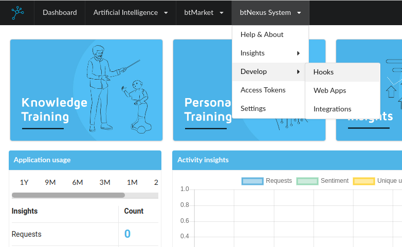
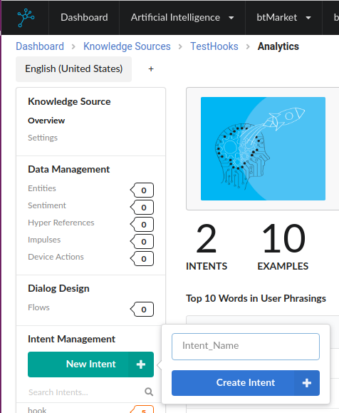
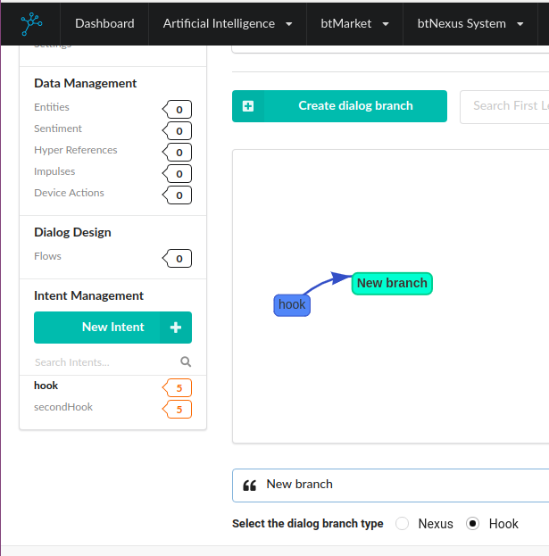
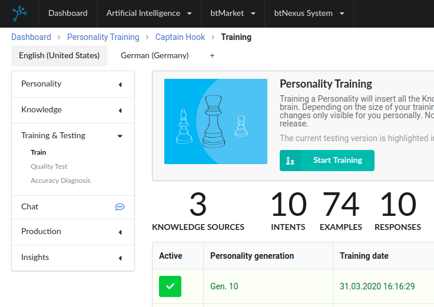

# HOOKS
Hooks are small programs that allow a Personality to use dynamic data. Dynamic data may change at any time in contrast to static data which is learned from the Knowledge Sources. Dynamic data can be for instance the weather or the results of your favorite football team.


## Set up a new Project
To implement a Hook you need to create a new project folder which includes at least the following files:
```
.
├── .btnexusrc
├── banner.jpg
├── captions.json
├── hook.py
├── icon.jpg
├── package.json
├── requirements.txt
└── settings.json
```
The following table describes the function of the different files. An example can be found in the `examples/hookExample` folder.
File | Description 
--- | --- 
`.btnexusrc` | This file holds the `CONNECT_HASH` for local debugging and the upload of the Hook.
banner and icon | The banner and the icon are images which will be displayed in the market. The banner has to have a resolution of 1300x300 pixels and the icon has to have a resolution of 256x256 pixels.
`captions.json` | This file holds translations to make a Hook multilingual. The keys are language tags while the values can be Strings or arrays of Strings. If an array of Strings is given the Hook will randomly choose from the Strings in it.
`hook.py` | This is the implementation of your Hook.
`package.json` | This file holds all settings for your project. 
`requirements.txt` | This file holds all python dependencies. See https://pip.pypa.io/en/stable/user_guide/#requirements-files
`settings.json` | This file holds the settings for the Hook which can be adjusted from the Instance.

You can copy all the files from the `examples/hookExamples` except for the `.btnexusrc` which you would need to create yourself.


## Set up the Hook in your Instance
To use a Hook, it must be set up in the Instance and added to a `Knowledge Source`. The following steps have to be performed:
### Step 1: create Hook <a name="step1"></a>

To create the Hook you need to press `Create new Hook` under the menu `btNexus System -> Develop -> Hooks`

You need to define a name for the new hook. After that you can click `create`


### Step 2: Copy the Connect hash
Under `btNexus System -> Develop -> Hooks` every Hook has a connect hash. This hash must be copied to the .btnexurc file we created earlier.

### Step 3: Create an Intent for the Hook
To use the Hook in the test chat of a personality you need to create an Intent for the Hook. Therefore you need to create or edit a `Knowledge Source` under `Artificial Intelligence -> Knowledge Training` and create a new intent. 


In the new Intent, create a new `dialog branch` and set `Hook` as type for the `dialog branch`. In the dropdown choose the Hook created in [step 1](#step1) and click Save Hook.


Under `User Phrasings` you need to define examples of phrasings that should trigger the hook. If the branch is set up press `Save Hook`.
*Remember that your `personality` needs a minimum of 5 intents to be trainable, so you may need to create additional Intents, or obtain some from btMarket.*

### Step 4: Train your Personality
To test the Hook you need to train the `Knowledge Source` with your Hook to a personality. To do so, choose the `personality` under `Artificial Intelligence -> Personality Training` , add your `Knowledge Source` to the Personality's Knowledge, and start a new training.


### Step 5: Test your hook
To test your Hook you need to run `npm install` on your project and start the Hook with `npm start`.
When the Hook is executing you can test it via the `Testchat` for your `personality`
(same place where you trained your personality)

## Adjust Settings and implement functionality
To customize the empty example hook, that that we created in earlier we need to do the following steps:

### Step 1: Copy connect hash to `.btnexusrc`
If you haven't done this before you need to copy the connect hash created in the instance to your `.btnexusrc` file now.

### Step 2 Create Banner and Icon: 
Create your own `icon` and `banner`. Keep in mind that the resolution for the `banner` is 1300x300 pixels and the resolution for the `icon` is 256x256 pixels.

### Step 3: Adjust the Captions
The `captions.json` file should hold all the phrases your Hook should be able to say in all supported languages. You need to use placeholders for the things your Hook should add. For Python `{}` is preferable because it can seemlessly be used with `self.getCaption(language, 'keyFromCaptionFile').format(stringWhichReplacesThePlaceholder)`

### Step 4: Adjust the Settings
The `settings.json` file holds all settings which can be adjusted through the Instance later. Make sure to follow the UUIDF standard.
<!-- Add link to definition of the standard -->

### Step 5: Adjust `requirements.txt`
In this file you need to add all your required libraries.
See https://pip.pypa.io/en/stable/user_guide/#requirements-files

### Step 6: Adjust your project settings
The `package.json` file holds all the settings for your project. The following table describes all the keys:

Key | Description 
--- | --- 
name | This is the name of the Hook. It can only contain lowercase and must be unique.
title | This shows as the title of the Hook in the Market.
description | This shows as the description of the Hook in the Market
type | This needs to be `"hook"`. For Integrations it would be `"integration"`
keywords | This is an array of keywords which makes it easier to find your Hook in the Market
version | The version field is important because you can only upload a version of a Hook once.
icon | Filename of the icon
banner | Filename of the banner
nexusVersion | with this field you can specifiy which Instance versions are supported by the Hook.
license | Here you can specify the license of your Hook
scripts | Don't touch these.
author | Add your Name and contact info here.
dependencies | If you develop in JS you can add your dependencies here. Don't remove `btnexus-hook`

### Step 7: Implement your Hook
If you set up everything you can implement your Hook in the `hook.py` file.
Make sure to implement `onMessage` which is triggered if the Personality asks the Hook for an answer. `onMessage` needs to call `say` to answer the Personality. Furthermore you can use `onConnected()` to do whatever you need to do when the Hook is connected. But remember this can be called multiple times, because the Hook can randomly disconnect due to connection issues. If you want to set up something which is only called once on the initialization of the Hook overload the `__init__` but remember to call `super` as first statement.

## Test your Hook locally
*We recommend to use a [virtual env](https://virtualenv.pypa.io/en/stable/) or [anaconda Environment](https://www.anaconda.com/) while developing.*
Whenever you want to test your Hook locally you need to call `npm install` if not done before and `npm run build` whenever you changed your dependencies in `requirements.txt` and `npm start` to start your Hook. 
While testing locally, you can only use the default settings from the `settings.json` file. The settings you get in `onMessage` will be empty, because you cannot set them in the Instance. Default settings cann be accessed for debugging with `self.getDefaultSettings()`.

If your Personality is trained with the Knowledge Source containing the Hook you can test the Hook by writing an example that should trigger the Hook in the internal chat.


## Uploading your Hook
To upload your Hook you need to `npm run compress` and `npm run upload`.
After that you can see the Hook in the Market in your private section(which means it is not yet visible for everyone in the Market). From here you can publish the Hook to the Market. 
<!-- TODO: Some Images here? -->
Now you can also use the settings of the Hook in your Personality under `Knowledge -> Hooks`.


